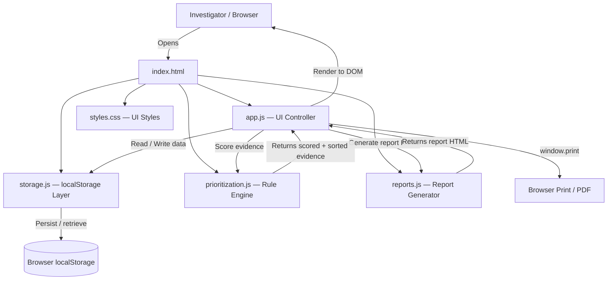

# Architecture

## System Architecture

ForensiTriage is a pure client-side single-page application. There is no backend server, no database, and no external API calls. All data is stored in the browser's localStorage.

## Components

| Component | File | Responsibility |
|---|---|---|
| UI Controller | `src/app.js` | Navigation, event handling, modal management, form validation, rendering all views |
| Persistence Layer | `src/storage.js` | CRUD operations on cases and evidence in localStorage; corruption recovery |
| Prioritization Engine | `src/prioritization.js` | Rule-based scoring, priority classification, factor explanations, exam recommendations, schedule generation |
| Report Generator | `src/reports.js` | Produces printable HTML report from case + prioritized evidence data |
| Stylesheet | `src/styles.css` | Dark forensic theme, responsive layout, print styles |
| Entry Point | `src/index.html` | HTML shell, navigation, view containers, modal, toast notification area |

## Data Flow

1. Investigator opens `src/index.html` in a browser.
2. `app.js` initialises, reads existing cases from `storage.js` (localStorage), and renders the dashboard.
3. When a case is created or edited, `app.js` validates the form and calls `storage.js` to persist.
4. When evidence is added, same pattern applies.
5. When the Priorities view is opened, `app.js` calls `Prioritization.prioritizeEvidence(evidence)`:
   - Each evidence item is scored across four factors (degradation, contamination, urgency, evidence value).
   - Items are sorted by effective priority then score.
   - Results are cached in `lastPrioritized` for reuse by Schedule and Report views.
6. If an override is applied, it is written to the evidence object in localStorage and the priority cache is invalidated.
7. The Schedule view sorts the cached prioritized list and adds slot rationale strings.
8. The Report view calls `Reports.generateReport(caseObj, withSchedule)` which produces a self-contained HTML string injected into the DOM.
9. Printing calls `window.print()` — the CSS `@media print` block hides navigation and formats for paper/PDF.

## Scoring Algorithm Detail

Each evidence item receives a score out of 100 from four independent factors:

| Factor | Max Points | Key Inputs |
|---|---|---|
| Degradation | 30 | Evidence type (biological/trace = perishable), condition, days since collection |
| Contamination | 25 | Contamination risk level (none/low/moderate/high) |
| Urgency | 25 | Investigator-set urgency (routine/normal/urgent) |
| Evidence Value | 20 | Evidence category forensic value (biological/fingerprint/digital = high) |

**Classification thresholds:** Critical ≥ 55, High ≥ 30, Routine < 30.

These thresholds and weights are prototype constants. They have not been validated against real forensic caseload data.

## Security Considerations

- No secrets, API keys, or credentials of any kind — the application makes no network requests.
- All user-entered text is HTML-escaped before insertion into the DOM, preventing XSS.
- localStorage is not encrypted — not suitable for real confidential forensic evidence. A clear warning is shown in the application and on every report.
- No external scripts, fonts, or CDN resources are loaded.

## Scalability Notes

As a browser-only prototype, scalability is intentionally out of scope. A production version would need:
- A secure backend API (e.g., Node.js / Python) with proper authentication
- An encrypted database (e.g., PostgreSQL) with audit logging
- Role-based access control (investigator, supervisor, lab analyst)
- The prioritization engine exposed as a backend service, with configurable weight profiles per laboratory
- Integration with LIMS (Laboratory Information Management Systems)
